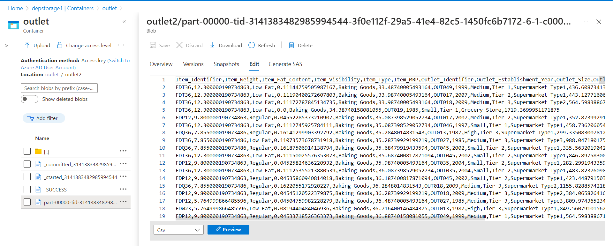

# End-to-End ETL Pipeline: Azure SQL Server Database to Azure Data Lake Storage (ADLS)

This exercise covers the creation of an end-to-end ETL pipeline that extracts data from an Azure SQL Server database, perform cleaning and transformation of the data using Databricks, and loads the transformed "Outlet Sales" dataset into Azure Data Lake Storage (ADLS). Follow these steps to understand the process.
 
## Architecture 

## Introduction

This exercise demonstrates the steps involved in building an ETL pipeline for transferring the "Outlet Sales" dataset from an Azure SQL Server database to Azure Data Lake Storage (ADLS) using the following components:

- Azure SQL Server Database: The source of the "Outlet Sales" data, which is initially created and populated with data using SQL queries.
- Databricks: Used for data extraction, transformation, and data loading.
- Azure Data Lake Storage (ADLS): The destination for the transformed "Outlet Sales" data.

## Prerequisites

Before you begin, ensure you have the following in place:

- An Azure SQL Server Database.
- Access to a Databricks workspace for data extraction, transformation, and data loading.
- An Azure Data Lake Storage account for data storage.
- Basic knowledge of Azure services and SQL queries.

## 1. Create Table Query and Data Insertion to SQL 

To initialize the "Outlet Sales" data in the Azure SQL Server Database:
- Create a database in a SQL server.
- Execute SQL queries to create the necessary table structure.
- Populate the table with sample data for the "Outlet Sales" dataset.
- Refer below SQL query to create and insert table in SQL Server.
 
 Query: [outlet.txt](https://github.com/shubhammirajkar/sales-outlet-etl-pipeline/blob/main/outlet.txt)
  

## 2. Extract Data to Databricks Notebook

In this step, we'll extract data from the Azure SQL Server Database:

- Set up a Databricks notebook.
- Configure the notebook to connect to your Azure SQL Server Database.
- Retrieve the "Outlet Sales" dataset using SQL queries.

 Notebook: [Outlet Sales.ipynb](https://github.com/shubhammirajkar/sales-outlet-etl-pipeline/blob/main/Outlet%20Sales.ipynb)

## 3. Transform Data with Databricks

Perform data transformations on the "Outlet Sales" dataset using Databricks:

- Implement business rules, clean data, and perform necessary transformations.
- Store the transformed data in a suitable format.
- Refer below notebook for the transformation code and connections.

## 4. Load Data to Azure Data Lake Storage 

Load the transformed "Outlet Sales" data into Azure Data Lake Storage using Databricks:

- Set up a Databricks notebook for data loading.
- Configure the notebook to connect to your ADLS.
- Store the transformed data in the specified location within ADLS.
- You can see the transformed data being loaded in ADLS in image below.

## Conclusion

This exercise provides an end-to-end overview of building an ETL pipeline for the "Outlet Sales" dataset, from data creation in Azure SQL to transformation and storage in Azure Data Lake Storage. You can further customize these steps to meet the specific requirements of your data integration project.

Reference: https://youtu.be/2fIwgGyscN4?si=TkGAdJc3KRqG-jhG
